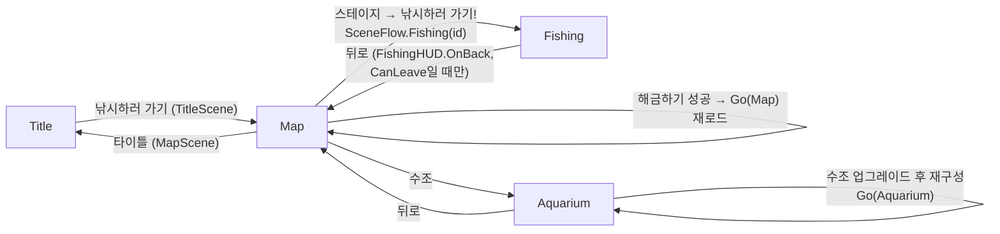
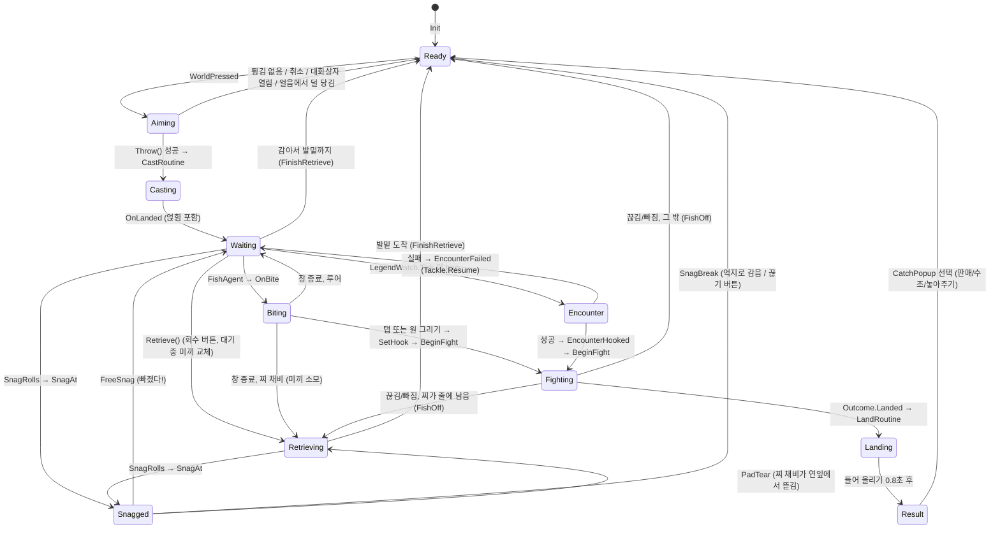

# 전체 구조

- **이 문서가 다루는 것**: 부트스트랩과 씬 흐름, 저해상도 픽셀 뷰·줌·입력, 낚시 상태 머신(`FishingController.S`), 렌더링 순서(sortingOrder)와 원근 투영(`Persp`), 부분 3D 액터 레이어, 발판 가림(front occlusion), 스크립트 실행 순서
- **관련 코드**: `Assets/Scripts/Core/` (`Game.cs`, `SceneFlow.cs`, `SaveData.cs`, `PixelView.cs`, `ViewZoom.cs`, `PointerInput.cs`), `Assets/Scripts/Scenes/`, `Assets/Scripts/Fishing/` (`FishingController*.cs`, `Persp.cs`, `StageView.cs`, `Angler.cs`, `Angler3D.cs`, `Reel3D.cs`, `ActorLayer.cs`, `ActorArt.cs`, `FrontOcclusion.cs`, `Tackle.cs`), `Assets/Shaders/`, `Assets/Editor/FishingKingSetup.cs`, `Tools/Blender/fk_persp.py`, `Tools/Blender/variants/hybrid/hyb_core.py`, `Tools/Blender/variants/hybrid/hyb_frontdepth.py`
- **관련 문서**: [README](../README.md) · [조작 상세](controls.md) · [테스트 스위치](testing.md) · [낚시 게임플레이](fishing_gameplay.md) · [수족관](aquarium.md) · [아트 파이프라인](art_pipeline.md) · [데이터 레퍼런스](data_reference.md) · [루어·전설어 조우 사양](lures_legend_spec.md) · [장애물 사양](obstacles_spec.md) · [시간대·물살 사양](time_currents_spec.md) · [변경 기록](../CHANGELOG.md)

이 문서는 "무엇이 어디서 만들어지고 어떤 순서로 그려지고 도는가"만 다룹니다. 게임플레이 수치(캐스팅 세기, 입질, 파이트, 장애물 확률 등)는 [fishing_gameplay.md](fishing_gameplay.md), 세이브·데이터 필드 목록은 [data_reference.md](data_reference.md), Blender 쪽 렌더 세부는 [art_pipeline.md](art_pipeline.md)에 있습니다.

---

## 1. 부트스트랩과 씬 흐름

### 1.1 씬 파일은 비어 있다

네 씬(`Assets/Scenes/Title.unity`, `Map.unity`, `Fishing.unity`, `Aquarium.unity`)은 메뉴 `FishingKing > Setup Project`(`Assets/Editor/FishingKingSetup.cs` `FishingKingSetup.CreateScene`)가 생성합니다. 각 씬에는 다음 두 가지만 있습니다.

- 직교 `Main Camera` (검정 배경, 위치 `(0, 0, -10)`)
- `<이름>Scene` 게임 오브젝트 하나와 그 부트스트랩 컴포넌트 (`TitleScene`, `MapScene`, `FishingScene`, `AquariumScene`)

씬 내용(배경, 낚시꾼, HUD, 물고기 등)은 전부 이 부트스트랩의 `Start()`에서 코드로 만듭니다. 빌드 설정의 씬 순서도 같은 메뉴가 `Title, Map, Fishing, Aquarium` 순으로 등록합니다.

### 1.2 `Game` 싱글턴

`Assets/Scripts/Core/Game.cs` `Game`은 씬을 넘어 살아 있는 상태·경제 매니저입니다.

| 단계 | 시점 | 하는 일 |
|---|---|---|
| `Game.Boot()` | `[RuntimeInitializeOnLoadMethod(BeforeSceneLoad)]` — 첫 씬이 로드되기 전 | `[Game]` 오브젝트 생성 + `DontDestroyOnLoad`, `SaveSystem.Load()`, `Sfx`·`Music`·`SceneFlow` 컴포넌트 추가, `AudioListener.volume` 설정, `Application.targetFrameRate = 60`, `QualitySettings.vSyncCount = 0` |
| `Game.DebugBoot()` | `[RuntimeInitializeOnLoadMethod(AfterSceneLoad)]` | 실행 인자(`-fkfresh`, `-fkrich`, `-fkgear`, `-fkencounter`, `-fkobstacles` …) 적용, `GameClock.DebugBoot()`, `-fkscene`이 있으면 `SceneFlow.PendingStage = -fkstage` 후 `SceneManager.LoadScene` |

그래서 README 말대로 **어느 씬에서 Play해도** 매니저가 생깁니다. 스위치 목록은 [testing.md](testing.md)에 있습니다.

접근자: `Game.I`(인스턴스), `Game.Data`(`SaveData`). 이벤트 `Game.Changed`(값이 바뀔 때마다), `Game.LeveledUp`. 코인·XP·인벤토리·장착·스테이지 해금·포획 기록·수족관 입출고 API가 모두 여기 있습니다(수치는 [data_reference.md](data_reference.md)).

### 1.3 저장 (개요)

- `Assets/Scripts/Core/SaveData.cs` `SaveData`: 직렬화되는 세이브 전체(`[Serializable]`, `JsonUtility`). 필드 목록은 [data_reference.md](data_reference.md) 참고.
- `SaveSystem.PathFile`: `Application.persistentDataPath/<이름>.json`, 기본 이름 `fishingking_save`, `-fksave <이름>`으로 바꿈.
- `SaveSystem.Save`: `.tmp`에 먼저 쓰고 원본을 지운 뒤 이동(쓰는 중 끊겨도 원본이 깨지지 않음).
- `SaveSystem.Load` → `Sanitize`: null 리스트 복구, 스타터 장비·`tank_0`·`lake` 보장, 없는 아이템 id는 스타터로, `clockMin`을 `0..1439.99`로, `zoomMode`가 `0..3` 밖이면 0. 읽기에 실패하면 `SaveData.NewGame()`.
- **언제 저장하나**: `Game.Notify()`(코인·XP·장착 등 모든 변경), `OnApplicationPause(true)`, `OnApplicationQuit`, `SceneFlow.Fishing()`, `FishingController.OnDestroy`(게임 시계) 등. 따로 "저장 버튼"은 없습니다.

### 1.4 `SceneFlow`

`Assets/Scripts/Core/SceneFlow.cs` `SceneFlow`는 `[Game]`에 붙어 씬 전환 페이드를 맡고, 고른 스테이지를 다음 씬으로 넘깁니다(`SceneFlow.PendingStage`).

- 페이드 캔버스 `sortingOrder = 32000` (모든 UI 위).
- `GoCo`: 페이드 인 0.25초 → `LoadSceneAsync` → 한 프레임 대기 → 페이드 아웃 0.3초. 알파는 `Mathf.Round(… * 6f) / 6f`로 6단계 양자화(픽셀 느낌). `Time.unscaledDeltaTime` 기준.
- 전환 중에는 `busy`라 중복 호출이 무시되고, 덮개 이미지가 `raycastTarget = true`로 입력을 막습니다.
- `SceneFlow.Fishing(stageId)`: `PendingStage`와 `Game.Data.lastStage`를 기록·저장한 뒤 `Go("Fishing")`.



출처: `TitleScene.Start`, `MapScene.Start`·스테이지 창(`SceneFlow.Fishing(st.id)`, 해금 후 `SceneFlow.Go("Map")`), `AquariumScene`(뒤로 버튼 → `Map`, 탱크 레벨이 올라가면 `SceneFlow.Go("Aquarium")`), `FishingHUD.OnBack`(밑걸림 중이거나 `!ctl.CanLeave`면 토스트만 띄우고 나가지 않음).

### 1.5 씬 부트스트랩이 만드는 것

| 씬 | 부트스트랩 (`Assets/Scripts/Scenes/`) | `Start()`에서 만드는 것 |
|---|---|---|
| Title | `TitleScene` | `PixelView.Create(검정)`, `StageView.Build("lake")`, `Angler.Create` (idle 포즈), 로고·버튼 캔버스(`UIKit.CreateCanvas("TitleUI", 10)`) |
| Map | `MapScene` | `PixelView.Create(#1d5e9c)`, 지도 스프라이트 `map_world`, 물결 30개, 시간대 틴트, `MapUI` 캔버스(상점·수조·도감·타이틀), 스테이지 마커(`Art.Map.markers`) |
| Fishing | `FishingScene` | 스테이지 id = `SceneFlow.PendingStage ?? Game.Data.lastStage ?? "lake"`(없거나 잠겨 있으면 `lake`) → `PixelView.Create` → `StageView.Build(id)` → `FishingController.Init(stage, pv)` → `Toast.Init()` → 첫 실행이면 튜토리얼 대화상자 |
| Aquarium | `AquariumScene` | 탱크 레벨의 `AquaLayout`, `PixelView.Create` + `SetBaseHeight(data.viewH)`, 뒤/앞 스프라이트, `AquaFeed`·`AquaClean`·`AquaDecor` ([aquarium.md](aquarium.md)) |

`FishingController.Init`이 만드는 것(`Assets/Scripts/Fishing/FishingController.cs`): `Angler.Create`, `Tackle.Create`, `FishSpawner`, 조준 점·부채꼴 점, `CastArrow`, `SideArrow`, 목표 링·입질 마크, `FishingHUD.Create`, `InitObstacles()`(`ObstacleOverlay`), `LegendWatch.For(this)`, `InitZoom()`, `InitMusic()`(스테이지 곡, [music.md](music.md)), 그리고 `SetState(S.Ready)`. 얼음 스테이지에서 얼음 구멍에 못 쓰는 루어가 장착돼 있으면 스타터 미끼로 바꿉니다(`LureInfo.IceOk`).

---

## 2. 픽셀 뷰, 줌, 입력

### 2.1 `PixelView` — 저해상도 렌더 타깃

`Assets/Scripts/Core/PixelView.cs` `PixelView`는 월드 카메라를 저해상도 렌더 텍스처에 그리고, 그것을 전체 화면 `RawImage`로 포인트 필터링해 보여 줍니다. 모든 스프라이트·선·회전이 같은 굵은 픽셀 격자에 맞춰집니다.

| 항목 | 값 / 동작 | 출처 |
|---|---|---|
| 1 유닛당 픽셀 | 16 | `PixelView.PPU` |
| 기준 크기 | 480 × 270 | `PixelView.BaseWidth`, `PixelView.BaseHeight` |
| RT 크기 (16:9 이상) | 높이 = `baseH`, 폭 = `min(640·k, h·aspect)` | `PixelView.Rebuild` |
| RT 크기 (16:9 미만) | 폭 = `480·k`, 높이 = `min(400·k, w/aspect)` | `PixelView.Rebuild` |
| `k` | `baseH / 270` (수족관 큰 탱크만 `SetBaseHeight`로 키움) | `PixelView.SetBaseHeight` |
| RT 형식 | `ARGB32`, 깊이 16, `FilterMode.Point`, 이름 `PixelRT` | `PixelView.Rebuild` |
| 카메라 | 직교, `orthographicSize = h / 2 / PPU`, near 0.1 / far 100 | `PixelView.Init`, `Rebuild` |
| 화면 지우기 | 별도 `ScreenClear` 카메라(`cullingMask = 0`, `depth = -100`)가 백버퍼를 검게 지움 | `PixelView.Init` |
| 표시 캔버스 | `PixelCanvas`, `ScreenSpaceOverlay`, `sortingOrder = -1000` (모든 UI 아래) | `PixelView.Init` |

640 × 400이 상한인 이유는 스테이지 이미지 자체가 640 × 400이기 때문입니다(`Tools/Blender/fk_persp.py` `W, H`). Blender 쪽 `hyb_core.CROP = (80, 65, 480, 270)`이 "게임이 기본으로 보여 주는 부분"입니다.

`LateUpdate`에서 하는 일: 화면 크기가 바뀌면 RT 재생성, 흔들림(`Shake(amp, time)`) 적용, 그리고 **카메라 위치를 1/16 유닛(= 1 픽셀)으로 스냅**해 화면이 일렁이지 않게 합니다. 화면↔월드 변환(`ScreenToWorld`, `WorldToScreen`)은 반드시 줌의 UV 크롭(`ViewZoom.UV`)을 거칩니다. UI 캔버스는 이 RT와 무관하게 원래 해상도로 그 위에 그려집니다.

### 2.2 `ViewZoom` — 표시 크롭으로 하는 줌

`Assets/Scripts/Core/ViewZoom.cs` `ViewZoom`은 `PixelView.Init`이 하나씩 붙입니다. **월드는 항상 RT 전체에 그려지고**, 줌은 표시용 `RawImage`의 `uvRect`(어느 부분을 보여 줄지)만 바꿉니다. 그래서 픽셀 뷰 안의 모든 것(스테이지, 액터 레이어, 물, 화살표, 장애물 윤곽, 조우 창)이 함께 확대되고 HUD 캔버스는 절대 확대되지 않습니다.

- **정수 배율 유지**: 정지 상태에서는 "게임 1픽셀 = 화면 n × n 픽셀"이 되도록 가장 가까운 정수 단계를 쓰고(`ViewZoom.StepOf`), 크롭 원점도 화면 픽셀에 스냅합니다(`ViewZoom.Apply`). 이징 중에만 분수 배율을 지납니다. `ViewZoom.PixelExact`로 확인 가능.
- **감독(Director) 패턴**: `ViewZoom.Director` 콜백이 매 프레임 `Want`(들어갈지), `Focus`(볼 곳), `Keep`(화면에 꼭 남길 점)을 부릅니다. 낚시 씬에서는 `FishingController.DirectZoom`(`FishingController.Zoom.cs`)이 감독입니다.
- 주요 상수: `Aim = 1.25`, `AimWide = 1.5`, `EaseTime = 0.6`초, `KeepTau = 0.08`초, `StepDownTime = 0.35`초, `StepUpHold = 1`초, `FitSlack = 3` / `FitSlackUp = 12` 게임 px (`ViewZoom` 상수).
- 모드 enum: `ZoomMode { X125 = 0, Off = 1, X150 = 2, Active = 3 }` — 0이 기본이라 설정 이전 세이브는 1.25배로 읽힙니다(`SaveData.zoomMode`).

모드별 동작(1.25배/1.5배/액티브/끔)은 `FishingController.Zoom.cs` 요약 주석에 정리돼 있고, 조작 관점 설명은 [fishing_gameplay.md](fishing_gameplay.md)에 있습니다. 여기서는 상태 머신과의 연결만 적습니다(4.4절).

### 2.3 `PointerInput` — 마우스/터치 통합

`Assets/Scripts/Core/PointerInput.cs` `PointerInput`(정적 클래스, Input System 기반).

- **지연 폴링**: 어떤 속성이든 처음 읽힐 때 `Poll()`이 돌고, `Time.frameCount`로 프레임당 한 번만 갱신됩니다. 그래서 컴포넌트 실행 순서와 상관없이 한 프레임 안에서는 모두 같은 값을 봅니다.
- **입력원 우선순위**: `SimActive`(AutoPilot 가상 포인터) → `Touchscreen.primaryTouch` → `Mouse.leftButton` → `Pointer`(펜은 Touch 취급).
- `Pressed` / `Released` / `IsDown` / `Position`, 누른 순간 UI 위였는지 `StartedOverUI`(`EventSystem.RaycastAll`), 그리고 `WorldPressed = Pressed && !StartedOverUI` — 월드 제스처는 전부 이것을 씁니다.
- `Samples`: 한 번 누르는 동안의 위치 샘플(프레임당 하나 + 뗀 위치; 뗀 위치가 마지막 샘플보다 아래면 제외). 최대 `MaxSamples = 240`, 차면 앞의 1/4을 버림. `FlickCast`가 캐스팅 판정에 읽습니다.
- `PressKind`(Mouse/Touch): 튕김 속도 단위가 달라서 필요합니다(`SimDpi > 0`이면 가상 포인터도 Touch).
- 키보드: `KeyHeld`, `KeyPressed`, `WalkKeys`(A/D·←/→, `SimLeft`/`SimRight` 포함).

원 그리기(`CircleGesture`), 톡(`LureInput`), 스윕(`SideSlide`)은 이 위에 쌓인 제스처 해석기이고, 모두 `FishingController.Update`에서 갱신됩니다. 제스처 수치는 [controls.md](controls.md)와 [fishing_gameplay.md](fishing_gameplay.md)에 있습니다.

---

## 3. 낚시 상태 머신

`Assets/Scripts/Fishing/FishingController.cs` `FishingController`는 `partial class`이고 네 파일로 나뉩니다.

| 파일 | 더하는 것 |
|---|---|
| `FishingController.cs` | 상태 enum `S`, `Init`, `Update` 디스패치, 준비·조준·캐스팅·대기·회수·입질·챔질·파이트·랜딩·결과, 전설어 조우 진입/종료(`StartEncounter`, `UpdateEncounter`, `EncounterHooked`, `EncounterFailed`), 낚싯대 스윕·사이드 프레셔, 물살 파이트, 게임 시계 틱(`TickClock`), 톡 낚싯대 채기(`RodJerk`) |
| `FishingController.Obstacles.cs` | 장애물 전부([obstacles_spec.md](obstacles_spec.md)): 비행 중 접촉(`OnContact`), 착수 처리(`LandPerched`, `LandedObstacles`, `LandOnPad`, `NaturalEntry`), 얹힌 채비(`UpdatePerched`, `KnockOff`), **밑걸림 상태 `S.Snagged`**(`SnagRolls` → `SnagAt` → `UpdateSnagged` → `FreeSnag` / `SnagBreak` / `CutLine` / `PadTear`), 커버로 도망치는 파이트(`BeginFightObstacles`, `TryCoverRun`, `StartCoverRun`, `PullOut`, `FightObstacles`, `EndFightObstacles`), 끊김 문구(`BreakText`), 구조물 근처 입질 배율(`StructureBite`) |
| `FishingController.Zoom.cs` | 줌 감독: `ZoomSetting`(매 프레임 `Game.Data.zoomMode`를 읽음), `ZoomWanted`, `InitZoom`(→ `view.Zoom.Director = DirectZoom`), `DirectZoom`, 테스트 훅 `DebugBreak` |
| `FishingController.Music.cs` | 배경음 감독([music.md](music.md)): `InitMusic`, 매 프레임 `TickMusic`(`Update`에서 `TickClock` 바로 다음, 대화상자로 일찍 반환하기 전; 상태·조우 단계·시간대·장력을 보고 `Music`에 바뀐 것만 요청), 이벤트 sting `CatchMusic`(`LandRoutine`), `FishOffMusic`(`FishOff`), `SnagBreakMusic`(`SnagBreak`), `LeaveMusic`(`OnDestroy`) |

### 3.1 상태 목록

```csharp
public enum S { Ready, Aiming, Casting, Waiting, Biting, Fighting, Landing, Result, Retrieving, Encounter, Snagged }
```

| 상태 | 의미 | 매 프레임 처리 |
|---|---|---|
| `Ready` | 채비를 걷고 서 있음. 좌우로 걸을 수 있음 | `UpdateReady` |
| `Aiming` | 아래로 당기는 중(와인드업). 얼음은 당긴 길이 = 수심 | `UpdateAiming` / `UpdateAimingIce` |
| `Casting` | 던지는 중 (채비 비행) | `Update` 안에서 `Angler.LineTarget`만 갱신 (비행은 `Tackle.Update`) |
| `Waiting` | 채비가 물에 있음(또는 바위·물가에 얹힘) | `UpdateWaiting` (얹힘이면 `UpdatePerched`) |
| `Biting` | 찌가 쑥 들어감 — 챔질 창 | `UpdateBiting` |
| `Fighting` | 물고기가 걸림 | `UpdateFighting` (`FightModel.Step`) |
| `Landing` | 물고기를 들어 올리는 연출 (코루틴) | `LandRoutine` |
| `Result` | 들어 올린 물고기가 매달려 있고 포획 카드가 뜸 | `HangSway` 코루틴 |
| `Retrieving` | 자동 회수 (회수 버튼, 미끼만 떼먹힘, 놓친 뒤 찌 회수) | `UpdateRetrieving` |
| `Encounter` | 전설어 조우 창 | `UpdateEncounter` (`LegendEncounter.Tick`) |
| `Snagged` | 밑걸림 | `UpdateSnagged` (`FishingController.Obstacles.cs`) |

`Landing`, `Result`는 `Update`의 `switch`에 case가 없습니다(코루틴이 진행).

### 3.2 전이



| 전이 | 조건 / 호출 | 출처 |
|---|---|---|
| Ready → Aiming | `PointerInput.WorldPressed` | `FishingController.UpdateReady` |
| Aiming → Ready | 와인드업이 무장되지 않았거나 위로 튕기지 않음(`FlickCast.Analyze` 결과 `!armed \|\| !flick`) | `FishingController.Throw` |
| Aiming → Ready | 대화상자가 와인드업 위에 열림(얼음 제외) | `FishingController.Update` |
| Aiming → Ready (얼음) | 뗐을 때 `AimPower < 0.08` | `FishingController.UpdateAimingIce` |
| Aiming → Casting | 튕김 성공 또는 얼음에서 충분히 당김 → `CastRoutine` (0.08초 뒤 `Tackle.Launch`) | `Throw`, `UpdateAimingIce`, `CastRoutine` |
| Casting → Waiting | `Tackle.Launch`의 착수 콜백 `OnLanded`. 얹힌 착수(`l.Perched`)도 Waiting으로 가고 `Tackle.Mode.Perched`로 구분 | `FishingController.OnLanded` |
| Waiting → Ready | 감아서 채비가 발밑(`Surface.z <= zNear + 0.3`, 얼음은 `Depth <= 0.05`)에 도착 | `WindTackle` → `FinishRetrieve` |
| Waiting → Retrieving | `Retrieve()` (HUD 회수 버튼), 대기 중 `EquipBait` | `FishingController.Retrieve`, `EquipBait` |
| Waiting → Biting | `FishAgent`가 입질하며 `ctl.OnBite(this)` 호출 | `Assets/Scripts/Fishing/FishAgent.cs`, `FishingController.OnBite` |
| Waiting → Encounter | `Watch.Tick(dt, soaking)`가 true (`soaking` = Waiting이고 채비가 물속 `Tackle.Mode.Water`). `LegendWatch.Tick`은 Ready/Aiming/Casting/Waiting/Retrieving에서만 은신처·단서를 진행 | `FishingController.Update`, `Legend/LegendWatch.cs` `LegendWatch.Tick` |
| Waiting/Retrieving → Snagged | 밑걸림 판정 | `FishingController.Obstacles.cs` `SnagRolls`, `SnagAt` |
| Biting → Fighting | `PointerInput.WorldPressed \|\| Gesture.Circling` | `UpdateBiting` → `SetHook` → `BeginFight` |
| Biting → Retrieving / Waiting | `biteWindow`가 0 이하. 찌 채비(`Tackle.UsesFloat`)는 미끼 소모 후 Retrieving, 루어는 Waiting | `UpdateBiting` |
| Encounter → Fighting | `LegendEncounter.Ph == Done && Success` | `UpdateEncounter` → `EncounterHooked` → `BeginFight(fish, e.Perfect)` |
| Encounter → Waiting | `Done && !Success`, `Tackle.Resume()` | `EncounterFailed` |
| Snagged → Waiting | 풀림, 또는 `Tackle.Snag == null` | `FreeSnag`, `UpdateSnagged` |
| Snagged → Ready | 억지로 감아 끊김 또는 `끊기` 버튼(`Retrieve()`가 Snagged면 `CutLine`) | `SnagBreak` |
| Snagged → Retrieving | 연잎에 걸린 찌 채비를 0.8 m 감아 뜯김 | `PadTear` |
| Fighting → Landing | `FightModel.Outcome.Landed` | `UpdateFighting` → `LandRoutine` |
| Fighting → Retrieving / Ready | `Outcome.Snapped` / `Spooled` → `LineBroke`, `Outcome.Escaped` → `FishEscaped`, 둘 다 `FishOff`. 찌가 줄에 남는 채비(`Tackle.FloatFight == Line`)면 `RetrieveWait = 0.7`초 뒤 회수, 아니면 Ready | `FishOff` |
| Landing → Result | 들어 올리기 루프(`t += dt / 0.8f`) 후 포획 등록(`MakeCatch`, `RegisterCatch`) | `LandRoutine` |
| Result → Ready | `CardDelay = 1`초 뒤 `CatchPopup.Show`, 선택 콜백 | `LandRoutine` |

`BeginFight`는 챔질과 전설어 조우 양쪽에서 쓰입니다. 전설어면 `Fight.Hold(0.5f)`로 0.5초 멈추고, 완벽한 챔질(`perfect`)이면 체력을 `0.85`로 시작합니다(`FishingController.BeginFight`). 조우 내부 단계(Omen, Eyes, Tease …)는 `LegendEncounter`의 순수 모델에 있고 [lures_legend_spec.md](lures_legend_spec.md) 2.3절을 따릅니다.

### 3.3 상태별 플래그

`Update` 한 곳에서 상태에 따라 켜고 끄는 것들입니다(출처는 모두 `FishingController.cs` / `FishingController.Zoom.cs`).

| 무엇 | 켜지는 상태 | 식 |
|---|---|---|
| 원 그리기 제스처 `Gesture.Update` | Waiting, Fighting, Biting, Encounter, Snagged | `gestureOn` |
| 루어 동사 `LureIn.Update` | Waiting(채비가 Water 또는 Perched), Encounter, Snagged | `LureIn.Update(…)` 세 번째 인자 |
| 낚싯대 스윕 `Slide.Update` | (얼음 제외) Waiting+Water, Retrieving, Fighting, Snagged. Biting에서는 `Slide.Freeze()` | `sweepIn`, `sweepKeep` |
| 게임 시계 `GameClock.Tick` | Result가 아니고, 대화상자가 없고, 앱이 포커스일 때. 한 프레임 최대 0.1초 | `TickClock` |
| 나갈 수 있음 `CanLeave` | Ready, Aiming, Waiting, Retrieving | `CanLeave` |
| 줌 요청 `ZoomWanted` | 1.25배/1.5배: Waiting, Biting, Fighting, Snagged · 액티브: Biting, Fighting · 끔: 없음 | `ZoomWanted` |

대화상자(`Dialog.Open`)가 열려 있으면 Fighting·Encounter가 아닌 한 `Update`는 제스처를 끄고 바로 반환합니다(파이트는 대화상자 뒤에서도 계속).

`SetState`가 공통으로 하는 일: Aiming이 아니면 조준 점·부채꼴·`CastArrow`를 숨기고 `Angler.WindUp = null`, Aiming·Ready가 아닌 상태에서 Ready로 오면 `walkLatch`(스윕 때 누르던 A/D가 곧바로 걷기가 되지 않게), 그리고 `FishingHUD.OnState(s)`로 HUD 구성 전환.

### 3.4 상태 머신과 줌

`DirectZoom`은 `ZoomWanted`가 거짓이면 줌아웃을 요청합니다. 이때 Aiming·Casting이면 `ZoomAimOut = 0.15`초로 서둘러 1배로 돌아가므로 **캐스팅은 항상 1배**입니다. Fighting이면 초릿대 끝과 물고기의 중간을 `ZoomFightTau = 1.2`초로 따라가고, 그 외에는 초릿대 끝과 채비를 `ZoomWaitTau = 0.5`초로 따라갑니다. 액티브 모드의 입질 줌인은 `ZoomBiteIn = 0.35`초입니다. 파이트 바가 가리는 위쪽은 `FightStripUnits = 76` 캔버스 단위 × `UIKit.ScaleFactor`만큼 `TopInsetPx`로 비워 둡니다. (모두 `FishingController.Zoom.cs` 상수)

---

## 4. 렌더링 순서

### 4.1 카메라와 레이어

| 카메라 | 무엇을 그리나 | 출력 |
|---|---|---|
| `Main Camera` (`PixelView.WorldCamera`, 직교) | 모든 스프라이트·라인 (3D 액터 레이어 29/30은 컬링 마스크에서 뺌) | `PixelRT` |
| `ScreenClear` | 없음(`cullingMask = 0`), 백버퍼만 지움 | 화면 |
| `ActorLayer` 카메라 (원근, 수동 `Cam.Render()`) | Unity 레이어 `ActorLayer.AnglerLayer = 29`(낚시꾼) / `ActorLayer.ReelLayer = 30`(릴) | 레이어별 투명 RT → 픽셀 뷰 안의 쿼드 |
| `EncounterView` 카메라 2대 | `EncounterView.FishLayer = 28`(3D 전설어, 원근) / `EncounterView.UwLayer = 27`(물속 세트, 직교) | 조우 창이 보일 때만, 크롭 쿼드로 픽셀 뷰에 표시 |

### 4.2 픽셀 뷰 안의 sortingOrder (낚시 씬)

한 이미지 안에서의 순서입니다. 숫자가 클수록 위에 그려집니다.

| order | 무엇 | 출처 |
|---|---|---|
| 0 | 스테이지 뒷 레이어 (`Back`, 시간대 전환 중 `BackIn`) | `StageView.OrderBack` |
| 1 | 구름 | `StageView.OrderCloud` |
| 2 | 새 | `StageView.OrderBird` |
| 10–19 | 물고기 그림자 (`10 + clamp(9 - z/6, 0, 9)`: 가까울수록 위) | `FishAgent` (`shadow.sortingOrder`) |
| 12 | 물속 미끼/루어 스프라이트 | `Tackle` (`baitSr.sortingOrder = … : 12`) |
| 13 | 루어 반짝임·흙먼지 | `Tackle.OrderUnder` |
| 19 | 전설어 눈빛 단서 (물고기 그림자 대역) | `Legend/LegendWatch.cs` |
| 20 | 물속 줄 (`UnderLine`) | `Angler.OrderUnderLine` |
| 21 | 물속으로 끌려 들어간 찌 | `Tackle` (`Angler.OrderUnderLine + 1`) |
| 25 / 26 / 27 / 28 / 30 | 물결 / 물마루 / 거품 / 파문 링 / 찌 물살 V자 | `WaterFx.OrderWave`, `OrderCrest`, `OrderFoam`, `OrderRing`, `OrderWake` |
| 30 | 파문 이펙트 | `Fx.OrderRipple` |
| 31 | 수면의 찌, 수면막 미끼, 조준 부채꼴 점, 장애물 조준 윤곽 | `Fx.OrderRipple + 1` (`Tackle`, `FishingController.Init`, `ObstacleOverlay.OrderAim`) |
| 32 | 케미라이트, 목표 링 | `Fx.OrderRipple + 2` |
| 40 | 스테이지 앞 레이어 (발판·바위·배, 시간대 전환 중 `FrontIn`) | `StageView.OrderFront` |
| 41 | 램프 불빛, 앞 레이어 위 물 효과(젖은 띠 등), 연잎 위 찌/미끼 | `StageView.OrderLight`, `WaterFx.OrderOverFront` |
| 42 | 물 밖으로 나온 물고기 (점프·랜딩) | `FishAgent` (`side.sortingOrder = 42`) |
| 43 | 장애물 전부 표시(`-fkobstacles show`) | `ObstacleOverlay.OrderShow` (`Fx.OrderSplash - 1`) |
| 44 | 물보라 | `Fx.OrderSplash` |
| 45 | 공중/얹힌 미끼, 공중의 찌(`Angler.OrderLine - 1`), 조우 어둡게(`OrderDim`) | `Tackle`, `Legend/EncounterView.cs` |
| 46 | 물 위 줄 (`Line`), 뒤쪽 매달린 줄 | `Angler.OrderLine` |
| 47 | 낚싯대(몸 뒤) — 릴은 −1, 낚싯대 위 줄은 −2 | `Angler.OrderRodBehind`, `Angler.SetRodFront` |
| 50 | 낚시꾼 몸 (스프라이트 또는 3D 레이어 쿼드) | `Angler.OrderBody` |
| 53 | 낚싯대(몸 앞) — 릴 52, 줄 51, 매달린 줄 54, 매달린 미끼 55 | `Angler.OrderRodFront`, `Angler.SetRodFront` |
| 57 | 사이드 프레셔 화살표 | `SideArrow.Order` (`Angler.OrderRodFront + 4`) |
| 58 | 캐스팅 가이드 화살표 | `CastArrow.Order` (`Fx.OrderSparkle - 2`) |
| 60 / 61 | 반짝임·조준 점 / 입질 마크 | `Fx.OrderSparkle`, `FishingController.Init` |
| 91 | 조우 창 크롭 쿼드 (물속 합성 결과) | `EncounterView.OrderCrop` |
| 94 / 95 / 96 | 조우 창 테두리 / 타이머 선 / 섬광·수면 와이프 | `EncounterView.OrderFrame`, `OrderTimer`, `OrderTop` |

릴 레이어는 `Angler.Init3D`에서 `OrderRodBehind - 1`로 만들어지고, 이후 `SetRodFront`가 낚싯대 앞/뒤에 맞춰 `o - 1`로 옮깁니다. 조우 창 안(물속 합성 RT)에는 `EncounterView`의 `UBg … USnowNear`(0–21), 위에서 보는 조우는 `EncounterView.Top.cs`의 `TBg …` 순서가 따로 있으며, 이들은 그 RT 안에서의 상대 순서일 뿐입니다.

다른 씬: 지도는 지도 0 · 물결 1 · 시간대 틴트 2(`MapScene`), 수족관은 뒷면 0 · 물고기 `10 + index % 20` · 거품 20 · 앞면 40 · 기분 아이콘 41 등(`AquariumScene`, 자세한 건 [aquarium.md](aquarium.md)).

### 4.3 캔버스(UI) 순서

| sortingOrder | 캔버스 | 출처 |
|---|---|---|
| −1000 | `PixelCanvas` (픽셀 뷰 RT 표시) | `PixelView.Init` |
| 10 | `HUD` / `TitleUI` / `MapUI` / `AquariumUI` | `FishingHUD`, `TitleScene`, `MapScene`, `AquariumScene` (`UIKit.CreateCanvas(…, 10)`) |
| 20000 | `[Dialogs]` | `Assets/Scripts/UI/Widgets.cs` |
| 30000 | `[Toasts]` | `Assets/Scripts/UI/Widgets.cs` |
| 32000 | `[Fade]` (씬 전환) | `SceneFlow.Awake` |

모든 캔버스는 `ScreenSpaceOverlay`, `pixelPerfect = true`, `referencePixelsPerUnit = PixelView.PPU`, `PixelCanvasScaler`를 씁니다(`UIKit.CreateCanvas`).

### 4.4 원근 투영 `Persp`와 Blender 카메라

게임 로직은 미터 단위 3D 공간(x 오른쪽, y 위 — 수면 = 0, z = 발에서 앞으로)에서 돌고, 화면에 그릴 때 `Assets/Scripts/Fishing/Persp.cs` `Persp`로 2D 픽셀 장면에 투영합니다. 배경 이미지는 Blender가 **같은 카메라 수식**으로 렌더하므로 찌·물고기·줄이 그림과 정확히 맞물립니다.

**카메라 값** (`Tools/Blender/fk_persp.py` 상수 → `fk_stages.py`가 `Assets/Resources/Data/stage_<id>.json`에 기록 → `Art.Layout(id)` → `StageLayout` → `new Persp(L)`):

| 값 | fk_persp.py | StageLayout 필드 | 현재 값 (7개 스테이지 공통) |
|---|---|---|---|
| 발 뒤 거리 | `CAM_BACK` | `camBack` | 10.5 m |
| 발 위 높이 | `CAM_UP` | `camUp` | 4.75 m |
| 내려다보는 각 | `PITCH` | `pitch` | 12° |
| 초점 거리 | `F_PX` (400 px 높이 이미지 기준) | `focalPx` | 520 px |
| 이미지 | `W, H, PPU` | `widthPx`, `heightPx`, `ppu` | 640 × 400, 16 |
| 발판 높이 | 스테이지별 | `standH` | lake 1.0 · stream 1.4 · sea 3.0 · swamp 0.9 · ice 0.25 · ocean 1.7 · cave 1.2 |

(값은 `Assets/Resources/Data/stage_*.json`에서 확인)

**투영 식** (`Persp.ToPixel`):

```
cam = (0, standH + camUp, -camBack)
r   = p - cam
depth = max(0.05, r.z·cos(pitch) - r.y·sin(pitch))
yc    = r.y·cos(pitch) + r.z·sin(pitch)
pixel = (f·r.x / depth, f·yc / depth)      // 이미지 중심 기준 픽셀
To2D  = pixel / PPU                        // 픽셀 뷰 월드 좌표 (배경 스프라이트가 원점 중심)
```

Blender 쪽(`fk_persp.setup_camera`)은 축만 다릅니다(Blender Y = 앞 = Unity z, Blender Z = 위 = Unity y). `sensor_fit = VERTICAL`, `sensor_height = 24`, `lens = F_PX · 24 / H`로 두어 400 px 높이에서 초점 거리가 정확히 520 px가 되고, `rotation_euler.x = 90° - PITCH`입니다. `fk_persp.project`는 `Persp.cs`를 그대로 옮긴 함수입니다. 현재 스타일(`Tools/Blender/variants/hybrid/hyb_core.py`)도 `import fk_persp as P`로 같은 상수를 쓰며, 수평선 `HORIZON_PY = P.F_PX · tan(P.PITCH)`는 `Persp.HorizonY = f·sin/cos/PPU`와 같은 식입니다(`StageView.Build`의 `horizonY`도 동일).

`Persp`의 다른 도구들:

| 메서드 | 용도 |
|---|---|
| `DepthOf(p)` | 카메라 깊이(m). 발판 가림 깊이 지도와 같은 양 (5절) |
| `PixelsPerMetre(p)`, `ScaleAt(p)` | 거리에 따른 크기 (발 위치에서 원래 픽셀 크기 = 1) |
| `Apparent(p)` | 물속 점의 굴절 보정(물 굴절률 `WaterIndex = 1.333`, 수직으로 들어 올림) |
| `Foreshorten(p)`, `ShadowSquash(p)` | 수면 위 평면 물체의 납작함 |
| `ToPlane(scene2D, planeY, out hit)` | 역투영(화면 점 → 수평면 교점). 캐스팅 방향 계산(`FishingController.YawOnScreenLine`)에 사용 |
| `VisibleHalfWidth(z, w)` | 거리 z에서 보이는 물의 반폭 |

---

## 5. 부분 3D: 낚시꾼·릴·전설어

낚시꾼과 릴(그리고 조우 속 전설어)은 실시간 3D 모델을 **픽셀 레이어**로 그려 2D 정렬 순서에 끼워 넣습니다.

### 5.1 `ActorLayer`

`Assets/Scripts/Fishing/ActorLayer.cs` `ActorLayer`:

1. 생성 시 픽셀 뷰 카메라의 `cullingMask`에서 자기 Unity 레이어를 빼고, 그 레이어만 보는 원근 카메라를 만듭니다(`enabled = false`, MSAA·HDR·동적 해상도 끔, `Near = 0.3`, `Far = 250`).
2. 픽셀 뷰 RT와 **정확히 같은 크기**의 투명 RT(`ARGB32`, 깊이 24, Point, `antiAliasing = 1`)에 렌더합니다.
3. 카메라는 `P.CameraPos`, 회전 `Euler(L.pitch, 0, 0)` — 즉 `Persp`와 같은 위치·각도입니다.
4. `Projection(w, h, cam2D)`: 초점 `L.focalPx`의 **오프센터 투영**으로, 주점을 픽셀 뷰 카메라가 보는 2D 원점에 맞춥니다(카메라 흔들림·중심 이동·`Offset`(먼바다 갑판 흔들림) 포함). 뷰 공간 점이 `Persp.To2D`가 그리는 바로 그 픽셀에 떨어집니다.
5. RT를 픽셀 뷰 크기의 쿼드(`MeshRenderer`)로 1:1 표시하고, 쿼드의 `sortingOrder`가 2D 순서 속 자리가 됩니다(낚시꾼 50, 릴은 낚싯대 −1).
6. 쿼드 재질은 `ActorArt.RimMaterial(stageId)`(ActorRim 셰이더)이고, 없으면 `Angler.LineMaterial` 복사본(림 없음)입니다.

카메라는 `LateUpdate`에서 수동으로 `Cam.Render()`합니다. 그래서 실행 순서가 중요합니다(7절).

### 5.2 `Angler3D`, `Reel3D`, `Angler`

- `Assets/Scripts/Fishing/Angler.cs` `Angler`: 낚시꾼 전체(걷기, 포즈, 낚싯대 `RodPainter`, 줄 `LineRenderer`, 매달린 미끼). `Init3D()`가 `Angler3D.TryCreate(ActorLayer.AnglerLayer, …)`로 모델을 만들고, 성공하면 `AnglerLayer`(order `OrderBody`)와 `ReelLayer`(order `OrderRodBehind - 1`)를 만들어 몸 스프라이트를 끕니다. 모델이 없거나 `-fkactors2d`(`Angler.Force2D`)면 포즈 스프라이트와 2D 릴 스프라이트를 씁니다. 낚싯대와 줄은 3D 공간에서 계산해 `Persp`로 투영한 1–2 px 선입니다.
- `Assets/Scripts/Fishing/Angler3D.cs` `Angler3D`: `Resources/Models/angler`(20본 리그의 강체 파츠). 포즈별 자세 블렌드(`Tau = 0.05`), 다리 2본 IK로 발 고정, 왼손은 낚싯대 손잡이·오른손은 릴 노브를 해석적 2본 IK로 잡음, 몸은 스프라이트처럼 `Yaw = 10°` 오른쪽으로 돌아 있고 그 위에 `BodyYaw`/`HeadYaw`. 손이 닿지 않는 목표는 카메라 광선을 따라 미끄러뜨려 화면상으로는 정확히 그 점에 주먹이 오게 합니다.
- `Assets/Scripts/Fishing/Reel3D.cs` `Reel3D`: `Resources/Models/reel_<id>`. 모델 계약은 원점 = 릴 발 윗면, +Z = 초릿대 방향, `Crank`는 로컬 X축 회전(+ = 감기), `Knob` = 오른손 목표, `Spool` = 줄이 나가는 점. 크랭크는 `Angler.ReelRevs`(= `Gesture.TotalRevs + autoRevs`)만큼 돕니다. 장비를 바꾸면 `Angler.RefreshGear`가 다시 만듭니다.

### 5.3 `ActorArt`와 셰이더

`Assets/Scripts/Fishing/ActorArt.cs` `ActorArt`:

- `Model(name)`: `Resources/Models/<name>` 로드(`Toon` 셰이더가 있을 때만).
- `Spawn(prefab, palette, layer, parent)`: FBX 재질을 이름으로 찾아 팔레트 json(`Resources/Models/<palette>.json`: 재질별 dark/mid/light/outline)으로 만든 **ActorToon** 재질로 교체하고 레이어를 지정.
- `RimFor(stageId)`: 스테이지별 햇빛 림(색, 세기 × `RimScale = 0.62`, 방향). 값은 `hyb_core.py PRESETS[stage].rim`을 옮긴 것. `RimMaterial(stageId)`로 ActorRim 재질 생성.
- `ApplyLook` / `Track`: 시간대 룩에 따라 림·키 라이트(`_KeyDir`)·틴트(`_Tint`)를 추적 중인 재질에 적용(`StageView.ApplyLook`에서 호출). 기본 키 라이트 `KeyDir = (0.752, 0.647, -0.125)`.

| 셰이더 (`Assets/Shaders/`) | 역할 |
|---|---|
| `ActorToon.shader` (`FishingKing/ActorToon`) | 패스 1 `TOON`: 하프 램버트 3단 램프(`_Bands` 기본 0.45 / 0.74), 스펙큘러·AA 없음, 선택적 줄무늬·노이즈. 패스 2 `OUTLINE`: 뒤집힌 헐 외곽선, 모델 임포터가 UV3에 쓴 스무딩 노멀로 정확히 `_OutlinePx` 픽셀 밀어냄, 알파 254/255로 기록(림 패스가 외곽선과 몸을 구분하는 표식). 루어 빛(`_LurePos.w > 0`)·`_SunMix`는 조우 전용 |
| `ActorRim.shader` (`FishingKing/ActorRim`) | 액터 레이어 RT를 1:1 표시하며, 바깥 실루엣의 햇빛 쪽에만 1 px 림을 더하고 그쪽 외곽선은 밝은 몸 색으로(스프라이트의 선택적 외곽선 재현). `_RimSpan`으로 모자에서 발로 갈수록 약해짐(`ActorLayer.RimSpan`) |
| `EncShadow.shader` | 수면형 전설어 조우를 위에서 볼 때 3D 물고기 레이어를 깊이에 따라 흐려지는 그림자로 표시 |
| `PeriodDissolve.shader` | 시간대 전환 시 들어오는 레이어를 4×4 베이어 디더로 1/16씩 교체 (`StageView`) |
| `FrontOcclude.shader` | 발판 가림 (6절) |

`Resources/Models/`의 `ActorToon.mat`, `ActorRim.mat`, `EncShadow.mat`, `FrontOcclude.mat`, `PeriodDissolve.mat`는 코드가 `Resources.Load<Material>("Models/…")`로 불러오는 기준 재질입니다(`ActorArt.Toon`, `ActorArt.RimMaterial`, `EncounterView.Top.cs`, `StageView.DissolveMaterial`, `FrontOcclusion.Material`). 모델·팔레트를 만드는 Blender 쪽(`hyb_actors3d.py`)은 [art_pipeline.md](art_pipeline.md)를 보세요.

전설어 조우의 3D 물고기(`Legend/Legend3D.cs`)는 `ActorLayer`가 아니라 `EncounterView`의 자체 원근 카메라(`FishLayer = 28`)가 같은 오프센터 투영 방식으로 그립니다([lures_legend_spec.md](lures_legend_spec.md) 2.5절, [legends_rollout.md](legends_rollout.md) 1.5절).

---

## 6. 발판 가림 (front occlusion)

**문제**: 줄(46), 물 밖 물고기(42), 물보라(44), 공중의 찌·미끼(45)는 앞 레이어(40) 위에 정렬되므로, 방파제·바위·배 뒤로 내려가도 그 위에 그려집니다.

**해결** (`Assets/Scripts/Fishing/FrontOcclusion.cs` `FrontOcclusion` + `Assets/Shaders/FrontOcclude.shader`): 앞 레이어의 픽셀별 **카메라 깊이 지도**와 비교해, 앞 레이어보다 먼 조각을 픽셀 단위로 버립니다.

| 요소 | 내용 |
|---|---|
| 깊이 지도 | `Assets/Resources/Sprites/Stages/<stage>_front_depth.png` (RGBA8, 640 × 400, `<stage>_front.png`와 픽셀 정렬). A ≥ 128 = 가리는 것 있음, `R·256 + G` = 16비트 깊이 코드, B ≥ 128 = 수면에 뜬 평평한 것(연잎·개구리밥: 아무것도 가리지 않음) |
| 범위 정보 | `Assets/Resources/Data/frontdepth_<stage>.json`의 `near`, `far`, `widthPx`, `heightPx`. 깊이 = `near + code · (far - near) / 65535` m (`FrontOcclusion.Bind`) |
| 깊이의 뜻 | `Persp.ToPixel(p, out depth)`의 depth와 같은 양 (`Persp.DepthOf`) |
| 허용 오차 | `FrontOcclusion.Bias = 0.12` m (발판 발치 수면에 놓인 줄이 살아남도록) |
| 얹힌 물체 | `FrontOcclusion.Resting = 0.6` m 더 가깝게 테스트 (바위 위에 얹힌 미끼가 자기가 놓인 면에 가려지지 않게) |
| 스프라이트 깊이 | 렌더러별 `MaterialPropertyBlock`의 `_OccDepth` (`SetDepth`). 0 이하는 `NoDepth = -1`로 저장 = 절대 가리지 않음 |
| 줄 깊이 | 꼭짓점마다 월드 z에 `depth · ZPerMetre`(`ZPerMetre = 0.01`)로 실음 (`FrontOcclusion.Point`). 셰이더가 `z · _FKOccZ`로 복원 → 줄이 발판 모서리에서 정확히 잘림 |

**흐름**:

1. `StageView.Build`가 `FrontOcclusion.Bind(this, id, fronts)` — 네 시간대의 앞 레이어가 모두 지도와 같은 크기여야 바인딩(시간대 전환 중 재바인딩 없음). 지도·json·셰이더 중 하나라도 없거나 크기가 다르면 아무것도 가리지 않음(예전 동작).
2. `StageView.Update`(룩 적용 직후)와 `StageView.LateUpdate`가 `PlaceOcclusion()` → `FrontOcclusion.Place(min, size)`: 앞 스프라이트가 실제로 그려지는 사각형(먼바다 갑판 흔들림 포함). 카메라 흔들림은 카메라를 움직이는 것이라 장면 좌표에는 영향 없음.
3. 전역 셰이더 값: `_FKOccTex`, `_FKOccRect`, `_FKOccDec`(near, step, bias, on/off), `_FKOccZ`.
4. `FrontOcclusion.Use(renderer)`로 재질을 한 번 붙이면 떼지 않습니다(상태가 바뀌어도 깊이만 바꿈 → 테스트 없이 그려지는 프레임이 없음). 사용처: `Angler`(줄 `line`, `dangle`, `dangleBait`), `Tackle`(`floatSr`, `baitSr`, `chemiSr`), `FishAgent`(물 밖 물고기 `side`), `Fx`(스폰 스프라이트). 낚시꾼·낚싯대·릴·화살표·HUD·반짝임은 쓰지 않습니다.
5. 셰이더(`FrontOcclude`)는 조각의 월드 xy로 지도 텍셀을 찾고, 가리는 텍셀이면 `clip(near + code·step + bias - d)`. 그 외는 `Sprites/Default`와 같은 출력(프리멀티플라이드 알파).

CPU 쪽에도 같은 판정이 있습니다(`OccluderAt`, `Hidden`, `AnyNearer`) — 테스트(`-fkauto occlusion`, `-fkoccwatch`)와 `Debug/OcclusionWatch.cs`가 씁니다. `-fkocclusion off`로 시작 시 끌 수 있습니다(`FrontOcclusion.OffArg`).

깊이 지도는 `Tools/Blender/variants/hybrid/hyb_frontdepth.py`가 각 스테이지의 앞 장면을 `hyb_<stage>.py`와 같은 시드로 다시 만들어, 같은 카메라로 View Z Depth를 반정밀도 한계를 피하도록 R(정수부)/G(소수부)로 나눠 렌더한 뒤 인코딩합니다. 검사(카메라 대 `Persp` 수식, 격자 광선 투사, 탐침점) 결과는 `_tmp/frontdepth/`에 남습니다. 자세한 절차는 [art_pipeline.md](art_pipeline.md).

---

## 7. 실행 순서

### 7.1 `DefaultExecutionOrder` 전체 목록

`grep DefaultExecutionOrder Assets/Scripts`로 찾은 전부입니다. 붙어 있지 않은 컴포넌트는 0입니다.

| order | 클래스 | 주로 쓰는 콜백 | 왜 이 순서인가 (코드 주석) |
|---|---|---|---|
| 0 (기본) | `FishingController`, `FishAgent`, `StageView`, `PixelView`, `FishSpawner`, `WaterFx`, `Fx`, `ObstacleOverlay`, `ReelGrip` 등 | `Update` / `LateUpdate` | — |
| 50 | `Angler` (`Assets/Scripts/Fishing/Angler.cs`) | `LateUpdate` | 물고기(0)의 `LateUpdate`가 그린 입 위치에 물속 줄을 이어야 하고, `Tackle`(90)·화살표(100)·줌(950)보다 먼저 이 프레임의 초릿대와 줄을 확정해야 함 |
| 90 | `Tackle` (`Assets/Scripts/Fishing/Tackle.cs`) | `Update`, `LateUpdate` | 파이트 중 찌는 이 프레임에 `Angler`가 그린 줄 위에 놓여야 하고(`LateUpdate`), 사이드 프레셔 화살표(100)가 그 위치를 읽음 |
| 100 | `CastArrow` (`CastArrow.cs`) | `LateUpdate` | `Angler`가 포즈를 잡은 뒤 이 프레임의 머리 위에 매달림 |
| 100 | `SideArrow` (`SideArrow.cs`) | `LateUpdate` | `Angler`의 줄 입수점과 `Tackle`(90)의 찌 이후 |
| 950 | `ViewZoom` (`Assets/Scripts/Core/ViewZoom.cs`) | `LateUpdate` | 액터들의 `LateUpdate`(초릿대, 물고기, 찌) 이후에 감독(`DirectZoom`)이 위치를 읽고, 조우 HUD(1100) 이전 |
| 1000 | `ActorLayer` (`ActorLayer.cs`) | `LateUpdate` | `PixelView`(0)의 카메라 흔들림·스냅과 `Angler`(50)의 포즈 이후에 3D 카메라를 수동 렌더 |
| 1000 | `EncounterView` (`Legend/EncounterView.cs`) | `LateUpdate` | `PixelView`의 카메라 위치와 컨트롤러의 이번 프레임 입력 이후 |
| 1100 | `EncounterHUD` (`Legend/EncounterHUD.cs`) | `LateUpdate` | 조우 뷰(1000)가 창을 배치한 뒤 |

### 7.2 한 프레임의 흐름 (낚시 씬)

```
Update  (order 0)  FishingController.Update  입력(PointerInput 폴링, CircleGesture, LureInput, SideSlide),
                                              게임 시계, 배경음 감독(TickMusic), LegendWatch, 상태별 Update*,
                                              Angler 입력값 설정
                   Music.Update ([Game])      덱·스템·sting·칩튠 페이드와 음량, 로드된 덱의 동시 시작
                   FishAgent.Update           물고기 AI (OnBite → 컨트롤러 상태 전이)
                   StageView.Update           물살 틱, 시간대 룩, PlaceOcclusion, 구름·새·반딧불
                   FishSpawner / WaterFx / Fx ...
Update  (order 90) Tackle.Update              채비 비행·물속 움직임
(코루틴)           CastRoutine 등             WaitForSeconds 후 재개 (Update 뒤, LateUpdate 앞)
LateUpdate (0)     FishAgent.LateUpdate       Render: 그림자·물 밖 스프라이트, 입 위치
                   PixelView.LateUpdate       RT 크기 확인, 흔들림, 카메라 픽셀 스냅
                   StageView.LateUpdate       PlaceOcclusion (최종 앞 레이어 위치)
LateUpdate (50)    Angler.LateUpdate          걷기, 3D 포즈, 낚싯대, 줄(꼭짓점 깊이 포함)
LateUpdate (90)    Tackle.LateUpdate          파이트 중 찌를 이번 프레임 줄 위에
LateUpdate (100)   CastArrow / SideArrow
LateUpdate (950)   ViewZoom.LateUpdate        Director(DirectZoom) → 줌·팬 → 표시 UV
LateUpdate (1000)  ActorLayer.LateUpdate      3D 카메라 Cam.Render() → 쿼드
                   EncounterView.LateUpdate   조우 창 합성
LateUpdate (1100)  EncounterHUD.LateUpdate
```

### 7.3 순서에 기대는 곳 / 주의할 점

- **같은 order끼리는 순서가 정해져 있지 않습니다**(Unity 동작). `FishingController.Update`와 `FishAgent.Update`가 둘 다 0이라, `OnBite`로 인한 전이가 같은 프레임의 컨트롤러 처리 전에 올지 후에 올지는 보장되지 않습니다. 코드는 이런 곳에서 방어적으로 씁니다. 예: `StageView.PlaceOcclusion`은 "Update들이 어떤 순서로 돌든" `LateUpdate`에서 한 번 더 부름.
- **입력은 순서 무관**: `PointerInput`은 프레임당 한 번 지연 폴링이라 누가 먼저 읽든 같은 값입니다.
- **줄·찌·화살표의 한 프레임 일치**: 물고기(0) → 낚시꾼(50) → 찌(90) → 화살표(100) → 줌(950). 이 사슬이 깨지면 줄 끝이 한 프레임 전 물고기 입에 붙거나 찌가 줄에서 떨어져 보입니다(`Angler`, `Tackle` 클래스 주석).
- **파이트 위치 계산은 그린 초릿대가 아니라 `Angler.RodTipPlan`을 씀**: 그린 끝(`RodTip`)은 줄 쪽으로 휘고 모자 회피 기울기가 들어가서, 그것으로 물고기 위치를 정하면 한 프레임씩 자리가 뒤바뀌는 피드백이 생겼다고 `Angler.RodTipPlan` 주석에 적혀 있습니다.
- **던진 직후 한 프레임**: `Tackle.Launch`는 `Update` 이후 코루틴에서 불리므로, 즉시 `DrawFlying(from)`으로 위치·순서·깊이를 잡아 한 프레임 이전 위치에 보이는 것을 막습니다(`Tackle` 주석). 같은 이유로 `OnBite`는 `PlaceBiteMark()`를 바로 부릅니다.
- **3D 레이어는 카메라 스냅 이후**: `ActorLayer`(1000)가 `PixelView`(0)보다 늦게 돌아야 흔들림·스냅된 카메라 위치로 오프센터 투영을 계산해 스프라이트와 같은 픽셀 격자에 떨어집니다.
- **HUD의 줌 여백**: `ViewZoom.TopInsetPx`는 `DirectZoom`이 매 프레임 설정하고, 같은 `LateUpdate` 안에서 곧바로 쓰입니다.
- **게임 시계와 물때 깊이**: `FishingController.Update`의 `TickClock`과 `StageView.Update`의 `StageLayout.TideOffset` 갱신은 둘 다 order 0이라 서로 한 프레임 어긋날 수 있습니다(물때 변화가 느려 눈에 띄지 않음 — 순서를 강제하는 코드는 없음).

---

## 사양서와 달라진 점

| 사양서 · 절 | 사양서 내용 | 코드 (출처) |
|---|---|---|
| [lures_legend_spec.md](lures_legend_spec.md) 2.5 (4. The line in the window, 5. Front FX, 7. Eyeshine) | 조우 창 안의 줄·앞쪽 효과·눈빛은 픽셀 뷰의 sortingOrder 93 스프라이트 | 이들은 픽셀 뷰가 아니라 물속 합성 RT 안에서 그려짐(`EncounterView` 상수 `ULine = 14`, `UFx = 17`, `UEyes = 19`, `UEyeCore = 20`)이고, 결과가 크롭 쿼드(`OrderCrop = 91`) 하나로 표시됨. 픽셀 뷰에 order 93을 쓰는 곳은 없음 (`Assets/Scripts/Fishing/Legend/EncounterView.cs`) |
| [lures_legend_spec.md](lures_legend_spec.md) 2.5 (3. Quads) | 배경 RT와 물고기 RT를 쿼드 두 개(`quadBack`, `quadFish`)로 표시 | 물고기 타깃은 세트의 림 재질을 거쳐 물속 합성 RT 안의 "fish layer"로 들어가고, 픽셀 뷰에는 쿼드 하나로 표시 (`EncounterView` 클래스 요약 주석: "That target is shown in the pixel view by one quad") |
| [lures_legend_spec.md](lures_legend_spec.md) 1.1 | `LureInput`은 Waiting과 Encounter 상태에서 갱신 | Snagged에서도 갱신(톡으로 밑걸림을 풂), Waiting은 채비가 `Water` 또는 `Perched`일 때만 (`FishingController.Update`) — 장애물 사양([obstacles_spec.md](obstacles_spec.md) 6.5)이 더한 것 |

위 외에 이 문서가 다룬 범위(상태 목록, `CanLeave`, 조우 진입 시 처리, 밑걸림 진입 상태, 앞/뒤 레이어 order 0/40, 눈빛 단서 order 19, 조준 윤곽 `Fx.OrderRipple + 1`, 얹힌 미끼 45, 조우 테두리 94·타이머 95)는 사양서와 코드가 일치합니다.
